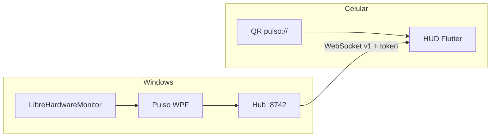

<p align="center">
  
</p>

<p align="center">
  <b>Dashboard Windows nativo</b> + <b>HUD gamer no celular</b>.<br>
  Sem conta. Sem nuvem. Um QR na mesma Wi‑Fi.
</p>

<p align="center">
  <a href="https://github.com/marcosangelo/pulso/actions/workflows/ci.yml"></a>
  <a href="LICENSE"></a>
  
  
</p>

<p align="center">
  <a href="#-por-que-existe">Por quê</a> ·
  <a href="#-como-usar">Usar</a> ·
  <a href="#-o-que-o-hardware-entrega">Hardware</a> ·
  <a href="#-arquitetura">Arquitetura</a> ·
  <a href="#-contribuir">Contribuir</a>
</p>

---

## Por que existe

Quem joga ou compila num **monitor só** não tem para onde olhar CPU, GPU e temp. Overlay em cima do jogo atrapalha. Um segundo PC é luxo.

O **Pulso** é o segundo painel: o programa no Windows lê o hardware (a mesma pilha do HWMonitor) e o celular vira um HUD escuro, legível a 50 cm.

> Fonte genérica **não** vira voltímetro. O trilho 12 V, quando aparece, é sensor da **placa**. O produto fala isso na cara — não vende milagre.

## Como usar

### Windows

| | |
|---|---|
| 1 | [.NET 8 SDK](https://dotnet.microsoft.com/download/dotnet/8.0) (uma vez) |
| 2 | `publicar.bat` → sai `dist/Pulso/` |
| 3 | `Abrir-Pulso.bat` **ou** `dist/Pulso/Pulso.exe` |
| Admin | `Abrir-Pulso-Admin.bat` — fans, temp da placa, 12 V (Super I/O) |

Zip **a pasta inteira** `dist/Pulso` para mandar a alguém. Self-contained: o amigo não precisa ter .NET.

Histórico local: `%LOCALAPPDATA%\Pulso\history.db` (30 dias).

O Defender às vezes avisa em `.exe` novo. É o empacotador.

### Celular

Mesma Wi‑Fi. No PC, aba **Celular**. No aparelho:

```bash
cd app
flutter pub get
flutter run
```

Firewall do Windows: Pulso na rede **privada**, porta **8742**. Hotel com isolamento entre aparelhos não emparelha.

Guia do app: [`app/README.md`](app/README.md).

## O que o hardware entrega

| Card | Fonte | Quando some |
|------|--------|-------------|
| CPU · RAM · GPU | LibreHardwareMonitor | Quase nunca |
| Temp CPU · fans · 12 V | Super I/O / LPC da placa | Sem administrador, ou chip escondido |
| Temp GPU | Driver NVIDIA / AMD | Sem driver |
| Disco C: | Windows | Quase nunca |
| 12 V · 5 V · 3.3 V | Sensor da **placa**, não da PSU | Fonte genérica não fala com o Windows |

Amostra na tela a cada **1 s**. Grava SQLite a cada **5 s**.

Abas no desktop: **Ao vivo** · **Histórico** · **Sensores** · **Celular** · **Sobre**.

## Arquitetura



| Camada | Onde | Papel |
|--------|------|--------|
| Sensores | `src/Pulso/Hardware` | LHM: CPU, GPU, RAM, fans, trilhos |
| Histórico | `src/Pulso/Data` | SQLite local |
| Pairing | `src/Pulso/Link` | QR + WebSocket LAN |
| Contrato | envelope JSON **v1** | Campos novos entram opcionais |
| HUD | `app/lib/features/hud` | Retrato e paisagem |

```
Pulso/
├── src/Pulso     dashboard Windows
├── app           HUD Flutter
├── docs          banner e assets de doc
├── publicar.bat
└── Abrir-Pulso*.bat
```

`dist/` é gerado. Não vai no git.

## Stack

| Desktop | App |
|---------|-----|
| .NET 8 · WPF | Flutter 3.47 · Dart 3.13 |
| LibreHardwareMonitor 0.9.6 | Riverpod 3 · go_router |
| HttpListener + WebSocket | Câmera + [ML Kit](https://developers.google.com/ml-kit) |
| SQLite | Material 3, tema neon |

## Contribuir

Leia **[`CONTRIBUTING.md`](CONTRIBUTING.md)** — o que entra, o que não entra, e como abrir PR.

- Issues: [bug](https://github.com/marcosangelo/pulso/issues/new?template=bug.yml) · [ideia](https://github.com/marcosangelo/pulso/issues/new?template=feature.yml)
- Conduta: [`CODE_OF_CONDUCT.md`](CODE_OF_CONDUCT.md)
- Falha de segurança: [`SECURITY.md`](SECURITY.md)

PRs pequenos, um assunto, teste descrito. Protocolo v1 não quebra sem issue.

## Licença

[MIT](LICENSE) © 2026 [Marcos Angelo](https://github.com/marcosangelo)

---

<p align="center">
  <sub>Feito para quem olha o PC com um olho só. O outro fica no jogo.</sub>
</p>
